## 1. Install VS Code ##
- Request IT to install Visial Studio Code.
[VScode installer](https://code.visualstudio.com/ "https://code.visualstudio.com/")

## 2. Install Anaconda ##
- Requset IT to insatall Anaconda Environment.
[Anaconda installer](https://www.anaconda.com/download/success "https://www.anaconda.com/download/success")

## 3. Create an anaconda environment to run python ##
1. Open VSCode
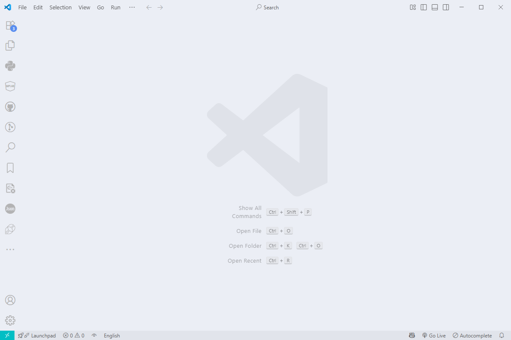

2. Install Python extensions
- Click "Extenesion"
- Search  "Python Extension Pack"
- Click "Install"
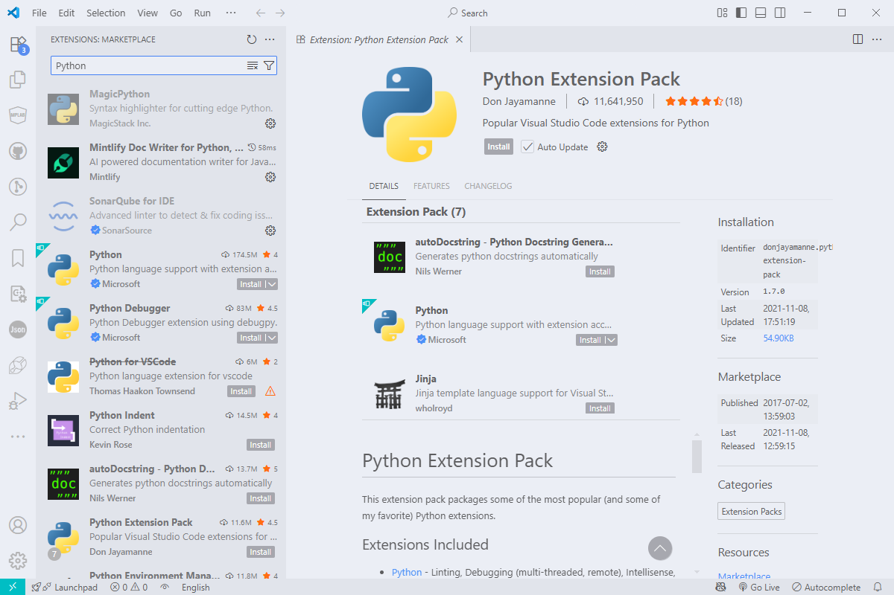

3. Create folder
- Click Explorer
- Click File > Open folder

- Select folder  
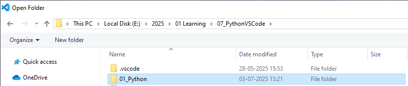

4. New python notebook file(.ipynb)
- Right click > New file  
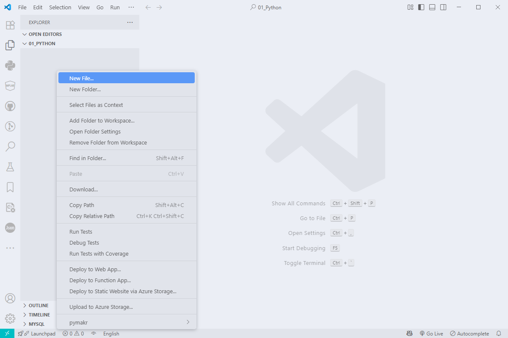
- Type filename + extension(.ipynb)  
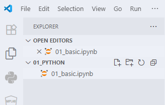
<!-- Comments
- Click "Select Kernel" > "Python Environments"
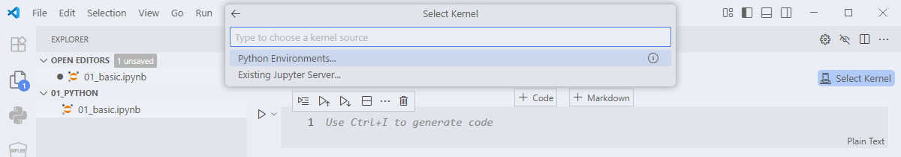
- Click "Create Python Environment
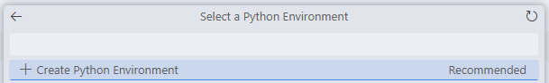
- Click "Conda"
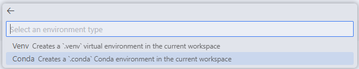
- Select Python version (Python 3.11)
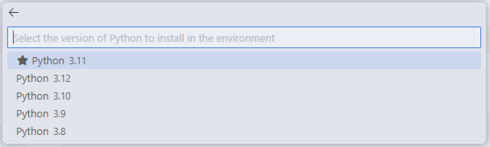
- Log will show

- After installation finished, Conda will show.

-->
- At Python Extension
- Click Conda > Create Environment  
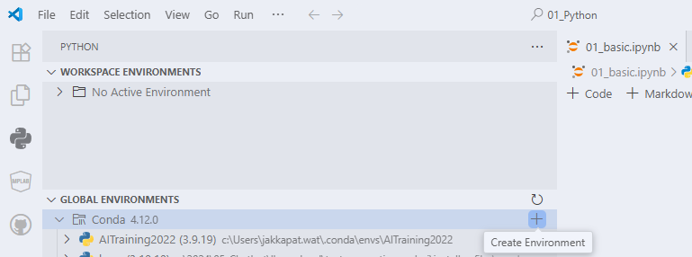
- Select Python version  
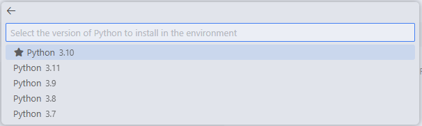
- Set Environment name > Press Enter  
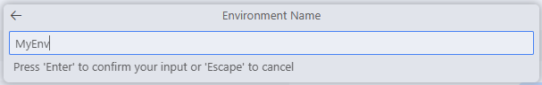
- Creating...  
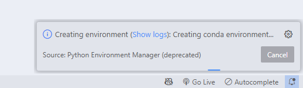
- After the environment creation was finished. Click on python notebook file(.ipynb)
- Click Select Kernel  
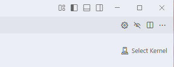
- Click Select Another Kernels > Python Environments > Your Environment\
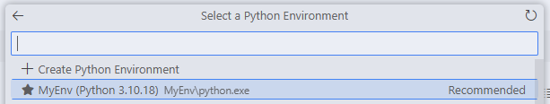
- Verify your environment with python code.
- Click Add Code Cell  
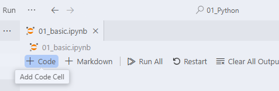
- Add python code 
    ``` py 
    print("Hello World")
    ```
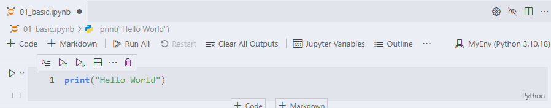
- Click Execute Cell or using short cut (Ctrl+Alt+Enter)  
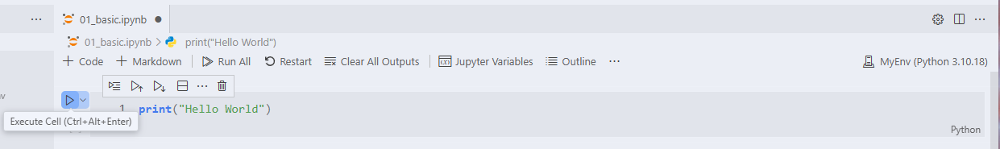
- Click Install to install ipykernel package
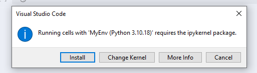
- It will recommend you to install by command.
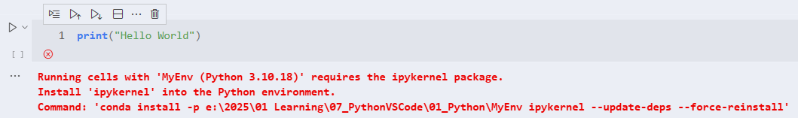
- To install by command, Go to your conda environment then Click "Open in Terminal"  
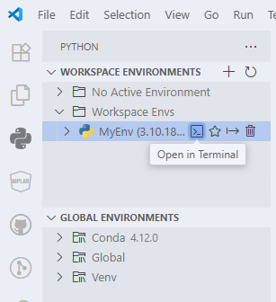
- Install ipykernel package by command to run in terminal  
- Copy this command to run in terminal.
```sh
conda install ipykernel
```

- Type "y" then press Enter to proceed  
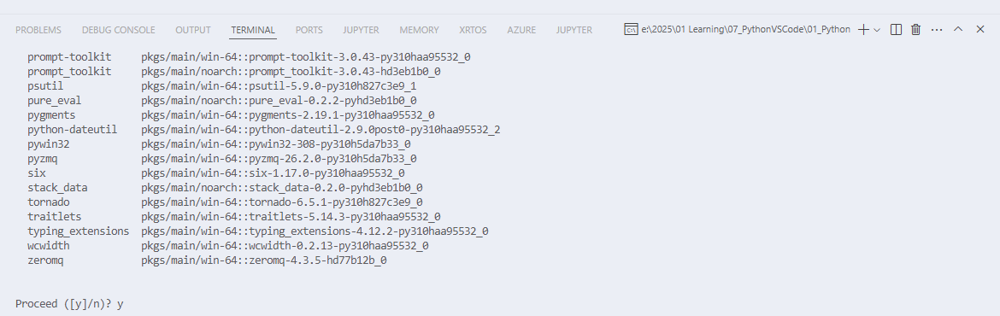
- Wait until the installation was finished  
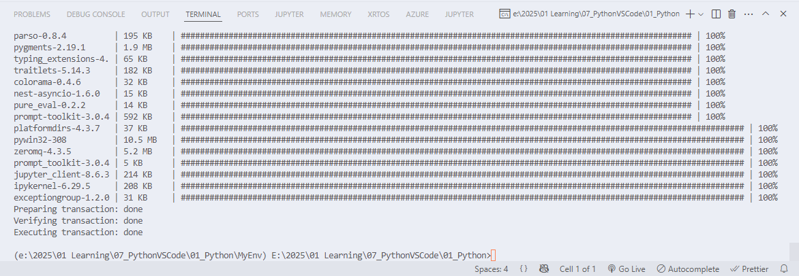
- Click Execute Cell or using short cut (Ctrl+Alt+Enter)  

- Execution outputs will show.  
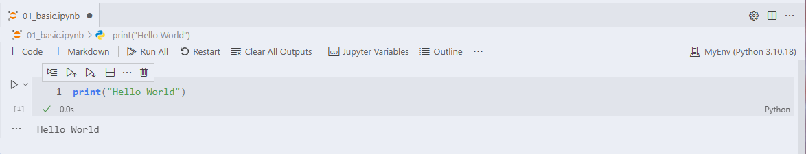
